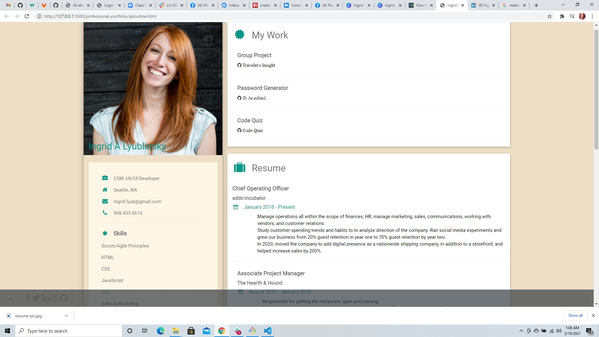

## Requirements

* Submit an updated portfolio featuring Project 1 and two exemplary homework assignments.
* Submit an updated GitHub profile with pinned repositories featuring Project 1 and two exemplary assignments.
* Submit an updated resume
* Submit an updated LinkedIn profile

## Links

* )
* 
* 
* 

## Demo

## Credits

* 
* 
* 
* 
